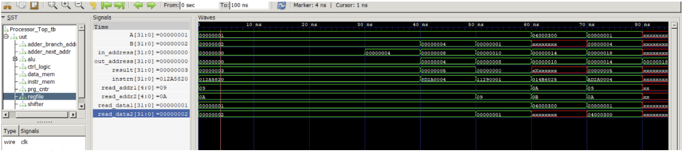
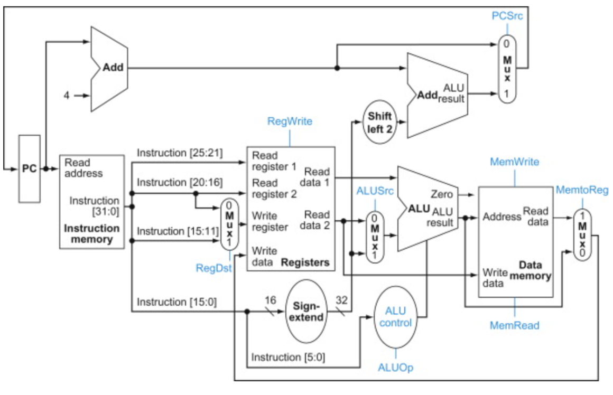

# CS3650Project1SingleCycle

Name(s):
Daniel Dinh 
and Mega Sari 

Using Project 0, we referenced the source from ElectroBinary and added all the files to create a single-cycle implementation for the project. Included are the ALU functions: lw/s, beq, and jump. 

Code Files Explanation:
Starting with the components of the processor datapath, we have the instruction memory to store all the instructions of a program. 
Next, is the program counter to hold the address of the current education and since the address increments every clock cycle, a new instruction will be executed. 
Next is the register file and which holds all the independent registers of the processor for the read and write operations. 
ALU will be working to support the R-Type Instruction: AND, OR, ADD, SUB, SLT, NOR. 

Processor_Top holds all the main functions and Control_Logic generates a control signal in order to operate depending on the instruction. 

Since all instructions don't take the same time to execute, we need to ensure the clock period is long enough to fit the execution from the slowest execution. 
To begin, there are three memory files that the processor can run, the instrn_memory.mem has all the instructions. 
The reg_memory.mem has the location of the particular register address and holds all the data. 
The data_memory.mem is used for the load and store operations. 

Results:

A holds for value 1
B holds for value 2
in_address is the location of the first instruction
out_address is the location of the last instruction
result puts it in the A and B operation
instrn is the first instruction for execution
read_addr1 and read_addr2 are the addresses for registers $t1 and $t2
read_data1 and read_data2 are the data for registers $t1

Architecture Design Map:

References: zybook and ElectroBinary 

